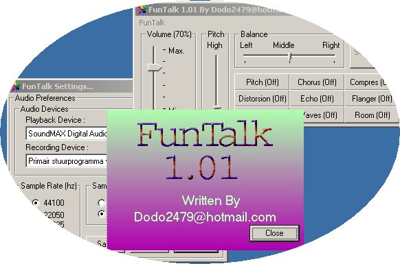



## FunTalk

### Description

Thanks to Gerald Youngblood(AC5OG) who's written articles about Digital Signal Processing and Software Defined Radios i came to the idea to make this. It's Just a simple vb app. that uses directsound to record your voice and add the effects to it.

(btw Sorry for my dab typing...)
 
### More Info
 

             |
---                |---
**Submitted On**   |2005-07-24 23:32:08
**By**             |[Geert](https://github.com/Planet-Source-Code/PSCIndex/blob/master/ByAuthor/geert.md)
**Level**          |Intermediate
**User Rating**    |4.4 (31 globes from 7 users)
**Compatibility**  |VB 6\.0
**Category**       |[DirectX](https://github.com/Planet-Source-Code/PSCIndex/blob/master/ByCategory/directx__1-44.md)
**World**          |[Visual Basic](https://github.com/Planet-Source-Code/PSCIndex/blob/master/ByWorld/visual-basic.md)
**Archive File**   |[FunTalk1917727262005\.zip](https://github.com/Planet-Source-Code/geert-funtalk__1-61915/archive/master.zip)

